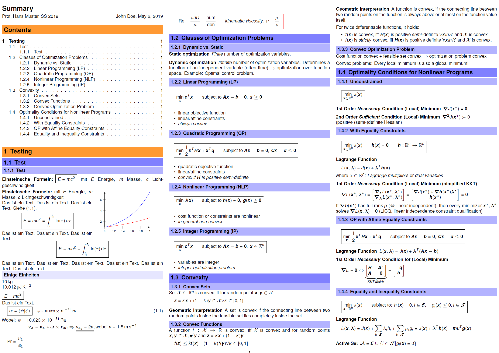

# latex-summary
A **space-efficient** LaTeX **lecture summary / cheat sheet template** especially suited for science and engineering students.

## Features

* Space-efficient text and formulas,
* Three columns,
* Landscape orientation,
* Sans serif font for text and math

